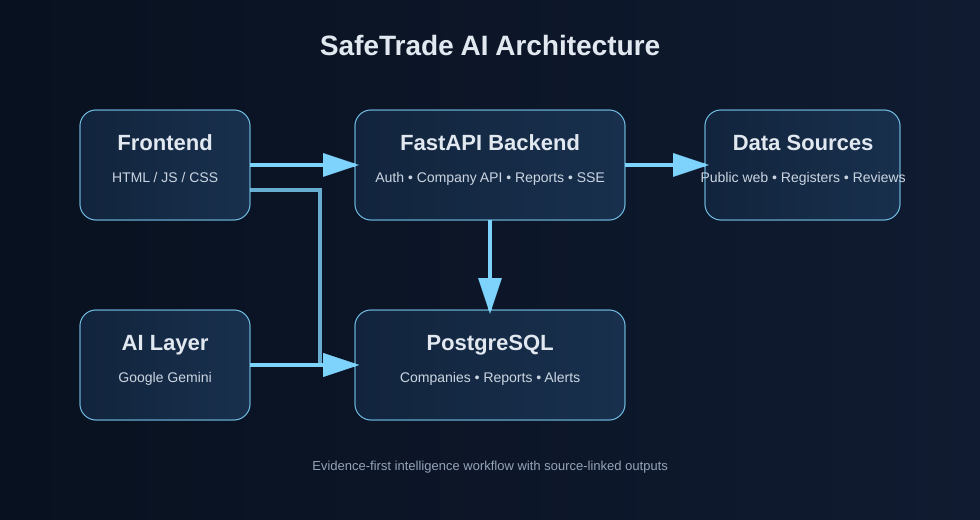

# 🛡️ SafeTrade AI

**English:** AI-powered business risk and reputation intelligence platform that aggregates evidence from public sources, resolves company identity, and presents findings with traceable references.

**Türkçe:** İşletmelerin ticari güvenilirliğini kamuya açık kaynaklardan toplanan kanıtlarla değerlendiren risk istihbarat platformu. Şirket kimlik çözümlemesi yapar ve sonuçları izlenebilir kaynak referanslarıyla sunar.

---

Türkiye'de ticaretin en büyük görünmez maliyeti "güvensizliktir". KOBİ'ler yeni bir tedarikçi veya müşteri ile çalışırken saatlerini manuel araştırmalarla harcıyor. SafeTrade AI, ticaretteki şüpheyi saniyeler içinde veriye dönüştürüyor.

## 🚀 Öne Çıkan Özellikler

* **LegalResolver™:** İşletmenin sadece tabela adını veya markasını girin. Sistemimiz çapraz doğrulama ile arka planda resmi ticaret sicil unvanını otomatik olarak tespit eder.
* **5 Boyutlu Veri Madenciliği:** Şikayetvar, EKAP, MERSİS, haber kaynakları ve dijital harita verileri eşzamanlı olarak taranır.
* **Gerçek Zamanlı AI Sentezi (Gemini 2.5 Flash):** Toplanan veriler anlık olarak işlenir; Memnuniyet, Kalite, Yönetişim ve Güven boyutlarında analiz edilerek ekrana canlı (SSE Streaming) sunulur.
* **SafeTrade Skoru:** Karmaşık veriler süzülerek işletmeye net bir güven skoru atanır.
* **Kaynak-Bağlantılı Raporlar:** Rapordaki her uyarı veya olumlu metin, taranan kaynaklardaki somut kanıtlara bağlıdır.

## 🛠️ Teknoloji Mimarı

Sistem, maksimum hız ve asenkron çalışma prensibiyle tasarlanmıştır:
* **Backend:** FastAPI (Python), SQLAlchemy, Alembic
* **Frontend:** Vanilla JS, HTML5, Özel Derin Uzay CSS Teması
* **Veritabanı & Altyapı:** Supabase (PostgreSQL), Docker
* **Yapay Zeka:** Google Gemini 2.5 Flash
* **Akış:** Server-Sent Events (SSE) ile kesintisiz veri aktarımı

## 👥 Takım

* **Eren Çelebi** - Backend Architecture & API Integration
* **Kayra Alan** - Data Services & Scraper Engine
* **Emirhan Kiren** - Frontend & UI/UX Design

## 🏗️ Mimari

## 🌍 Canlı Demo

Projemizi lokal kurulumlarla, Docker komutlarıyla uğraşmadan doğrudan canlı ortamda test edebilirsiniz.

👉 **Hemen Deneyin:** [www.safeai.com.tr](https://www.safeai.com.tr)

## ⚖️ Hukuki & Uyum Notu

Bu proje kamuya açık verilerle çalışan bir istihbarat sistemidir. Veri toplanması ve kullanımı konusunda bkz. `docs/legal.md`.
